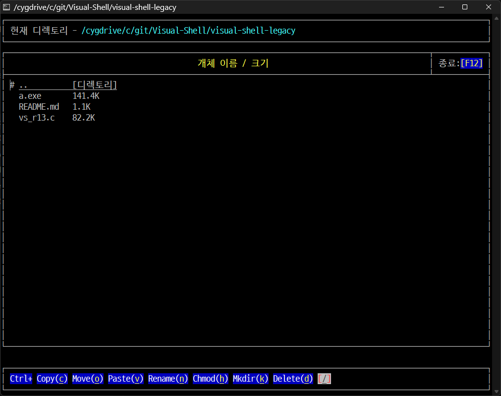

# 원본 코드

> 몇십년 전에 졸업 작품으로 내고 이후 수정이 없던 코드.. 😅
> 

---

## Rocky Linux 8 동작 확인

* 동작 미확인


---

## Cygwin 동작 확인

#### 라이브러리 설치 필요

* Setup 실행파일 실행시켜서 `ncurses-devel`로 검색해서 나오는 것 설치함. 그리고 `gcc`도 사용가능해야한다.
  * `libncurses-devel`  - `6.4.3.20230114`


### 단순 동작확인

* Cygwin에서 단순 동작 확인만 해봤는데,

  ```c
  set_escdelay(0); // ESCDELAY = 0;   // ESC키 입력에 대한 지연 시간 없앰.
  ```

  `ESCDELAY`가 `ncurses` 6.x 버전에서는 없어진 것 같다. `set_escdelay(0)` 함수를 호출해야한다.

  Cygwin에서 되는게 신기하네?  쉽게 안될 줄 알았는데...😅

  


### 빌드 수행

```sh
gcc -g -W -Wall vs_r13.c -lncursesw -lmenuw -lpanelw
```


---

## 특이사항

* 터미널 화면크기를 줄이거나 늘릴 때, 이전에 `CentOS` + `Putty` 환경에서는 알아서 맞춰줬던 것 같은데... 일단 `Cygwin`에서는 그게 안됨.
