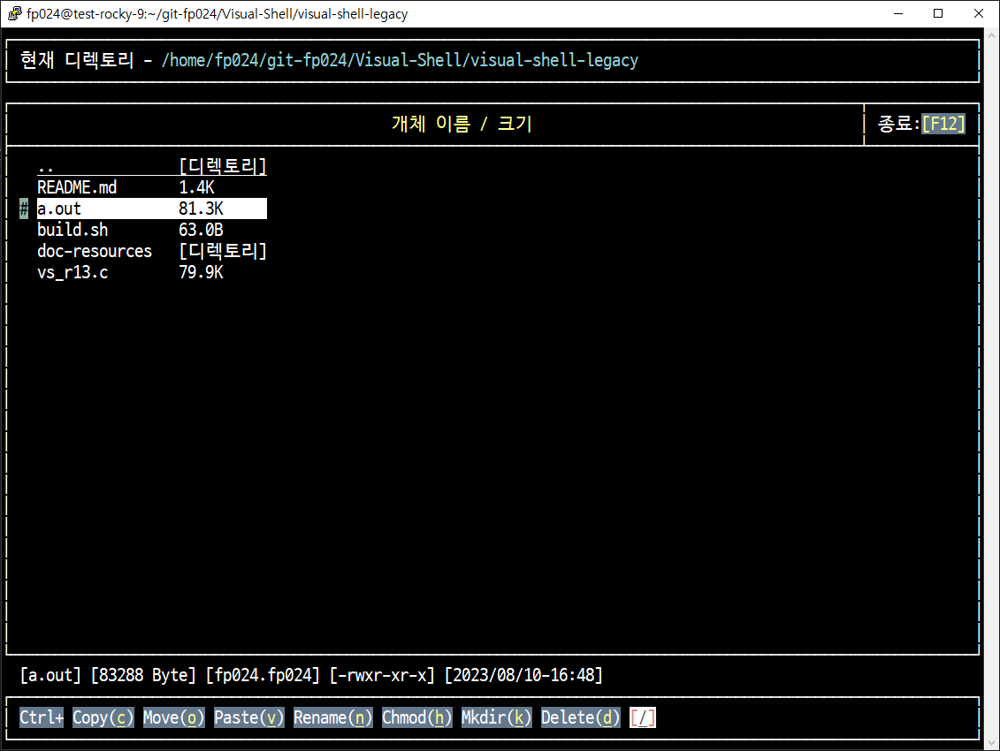

# 원본 프로젝트

> 몇십년 전에 졸업 작품으로 내고 이후 수정이 없던 프로젝트... 😅
> 

---


### 최초 개발 환경

* 운영체제: 
  * 집: Fedora 13 데스크톱
  * 학교: Solaris

* 개발환경: 
  * 집: gnome 터미널
  * 학교: 윈도우 시스템에서 Putty 접속

* 개발도구:
  * gcc 4.4.4
  * gdb 7.1
  * vi 7.2.441


## Rocky Linux 9 환경 동작 확인

#### 라이브러리 설치 필요

```sh
 sudo dnf install ncurses-devel
```

* 현시점에서 cygwin이 버전이 더 높긴하다..

  ```
  설치 중:
   ncurses-devel              x86_64           6.2-8.20210508.el9           appstream           517 k
  종속 꾸러미 설치 중:
   ncurses-c++-libs           x86_64           6.2-8.20210508.el9           appstream            38 k
  ...
  ```


#### 단순 동작 확인

일단 동작엔 문제 없는 것 같다. 그런데 종료할 때 세그멘테이션 오류남? 왜? 그럴까... 😅 




---

## Cygwin 환경 동작 확인

#### 라이브러리 설치 필요

* Setup 실행파일 실행시켜서 `ncurses-devel`로 검색해서 나오는 것 설치함. 그리고 `gcc`도 사용가능해야한다.
  * `libncurses-devel`  - `6.4.3.20230114` 설치시 같이 설치되는 항목
  
    ```
    Install libncurses++w10 6.4-3.20230114 (automatically added)
    Install libncurses-devel 6.4-3.20230114
    Install libpkgconf4 2.0.0-1 (automatically added)
    Install pkg-config 2.0.0-1 (automatically added)
    Install pkgconf 2.0.0-1 (automatically added)
    ```
  
    


### 단순 동작확인

* Cygwin에서 단순 동작 확인만 해봤는데,

  ```c
  set_escdelay(0); // ESCDELAY = 0;   // ESC키 입력에 대한 지연 시간 없앰.
  ```

  `ESCDELAY`가 `ncurses` 6.x 버전에서는 없어진 것 같다. `set_escdelay(0)` 함수를 호출해야한다.

  Cygwin에서 되는게 신기하네?  쉽게 안될 줄 알았는데...😅

  


### 빌드 수행

```sh
gcc -g -W -Wall vs_r13.c -lncursesw -lmenuw -lpanelw
```


---

## 특이사항

* 터미널 화면크기를 줄이거나 늘릴 때, 이전에 `CentOS` + `Putty` 환경에서는 알아서 맞춰줬던 것 같은데... 일단 `Cygwin`에서는 그게 안됨.
  * 착각 했었나보다.. 콘솔창 실시간 조정에 대응되진 않았었음... 😅 
